# BOSS Entity Relationship Diagram

> Version: 1.0.0 | Format: Mermaid ERD

---

## Core Aggregate Relationships

```mermaid
erDiagram
    organizations ||--o{ organization_memberships : has
    organizations ||--o{ businesses : owns
    organizations ||--o{ feature_flags : scopes

    businesses ||--o{ business_profiles : has_one
    businesses ||--o{ business_mri : has
    businesses ||--o{ business_dna : has_one
    businesses ||--o{ business_health : has_one
    businesses ||--o{ business_capabilities : has
    businesses ||--o{ business_timeline : has
    businesses ||--o{ constraint_instances : has
    businesses ||--o{ recommendation_instances : has
    businesses ||--o{ transformation_roadmaps : has
    businesses ||--o{ business_decisions : has
    businesses ||--o{ business_scenarios : has
    businesses ||--o{ diagnostic_reports : has
    businesses ||--o{ kpi_readings : has
    businesses ||--o{ business_goals : has
    businesses ||--o{ executive_briefings : has
    businesses ||--o{ customers : has
    businesses ||--o{ leads : has
    businesses ||--o{ jobs : has
    businesses ||--o{ appointments : has
    businesses ||--o{ invoices : has
    businesses ||--o{ integration_accounts : has
    businesses ||--o{ workflow_executions : has
    businesses ||--o{ scheduler_jobs : has
    businesses ||--o{ memory_records : has
    businesses ||--o{ business_discoveries : has_one
    businesses ||--o{ business_graphs : has_one

    business_mri ||--o{ business_mri_sections : has
    business_mri ||--o{ business_mri_responses : has
    business_mri_responses }o--|| business_mri_questions : references
    business_health ||--o{ business_health_dimensions : has
    diagnostic_reports }o--|| business_mri : references

    constraint_instances }o--|| constraint_definitions : references
    constraint_instances }o--|| constraint_categories : categorized_by
    constraint_instances ||--|| constraint_scores : has_one
    constraint_instances ||--|| constraint_priorities : has_one
    constraint_instances ||--o{ constraint_evidence : has
    constraint_instances ||--o{ constraint_relationships : has
    constraint_instances ||--o{ constraint_history : has

    recommendation_instances }o--|| recommendation_definitions : references
    recommendation_instances }o--|| recommendation_categories : categorized_by
    recommendation_instances ||--|| recommendation_scores : has_one
    recommendation_instances ||--|| recommendation_priorities : has_one
    recommendation_instances ||--|| recommendation_roi_estimates : has_one
    recommendation_instances ||--o{ recommendation_constraint_links : links
    recommendation_instances ||--o{ recommendation_evidence : has
    recommendation_instances ||--o{ recommendation_history : has
    recommendation_constraint_links }o--|| constraint_instances : links_to

    transformation_roadmaps ||--o{ transformation_roadmap_stages : has

    diagnostic_reports ||--o{ diagnostic_area_scores : has
    diagnostic_reports ||--o{ diagnostic_root_causes : has
    diagnostic_reports ||--o{ diagnostic_opportunities : has
    diagnostic_reports ||--o{ diagnostic_maturity_assessments : has
    diagnostic_reports ||--o{ diagnostic_priority_items : has
    diagnostic_root_causes }o--|| constraint_instances : references
    diagnostic_opportunities }o--|| recommendation_instances : references

    customers ||--o{ customer_interactions : has
    customers ||--o{ jobs : has
    customers ||--o{ appointments : has
    customers ||--o{ invoices : has
    customers ||--o{ payments : has
    customers ||--o{ customer_reviews : has
    leads ||--o| customers : converts_to
    jobs ||--o{ appointments : has
    jobs ||--o{ invoices : has
    jobs ||--o{ customer_reviews : has
    invoices ||--o{ payments : has

    integration_accounts }o--|| provider_definitions : uses
    integration_accounts ||--o{ credential_references : has
    tool_executions }o--|| tool_definitions : uses
    tool_executions }o--|| capability_contracts : fulfills
    tool_executions }o--|| provider_definitions : via
    tool_executions ||--o{ tool_audit_history : has
    tool_executions ||--o| provider_evidence : has
    tool_definitions }o--|| capability_contracts : implements
    permission_policies }o--|| tool_definitions : governs

    workflow_executions ||--o{ task_executions : has
    workflow_executions ||--o{ execution_events : has
    task_executions ||--o{ dead_letter_queue : may_become

    business_discoveries ||--o{ business_context_versions : has
    business_discoveries ||--o{ business_discovery_history : has
    business_graphs }o--|| business_discoveries : built_from
    business_graphs ||--o{ business_graph_nodes : has
    business_graphs ||--o{ business_graph_edges : has
    business_graphs ||--o{ business_graph_snapshots : has
    business_graphs ||--o{ business_graph_history : has

    provider_credentials ||--o{ provider_credential_audit : audited_by
    notification_deliveries }o--o| businesses : for
```

---

## Aggregate Boundaries (DDD)

### Identity Aggregate
**Root**: Organization  
**Members**: OrganizationMembership, UserTenantPreferences  
**Invariant**: A user may only access data for organizations they are a member of.

### Business Intelligence Aggregate
**Root**: Business  
**Members**: BusinessProfile, BusinessMri (+ sections/questions/responses), BusinessDna, BusinessHealth (+ dimensions), BusinessCapabilities, BusinessTimeline  
**Invariant**: All members are scoped to `(org_id, business_id)`.

### Constraint Aggregate
**Root**: ConstraintInstance  
**Members**: ConstraintScore, ConstraintPriority, ConstraintEvidence, ConstraintRelationships, ConstraintHistory  
**References**: ConstraintDefinition, ConstraintCategory (shared reference data)

### Recommendation Aggregate
**Root**: RecommendationInstance  
**Members**: RecommendationScore, RecommendationPriority, RecommendationRoiEstimate, RecommendationEvidence, RecommendationConstraintLinks, RecommendationHistory  
**References**: RecommendationDefinition, RecommendationCategory (shared reference data)

### Decision Aggregate
**Root**: BusinessDecision  
**References**: RecommendationInstance, ConstraintInstance  
**Related**: BusinessScenario (independent aggregate, compared via ScenarioComparison)

### Customer Aggregate
**Root**: Customer  
**Members**: CustomerInteraction  
**Related aggregates**: Job, Appointment, Invoice, Payment, CustomerReview (all linked by customer_id)

### Finance Aggregate
**Root**: Invoice  
**Members**: Payment  
**Related**: Customer, Job

### Loop Runtime Aggregate
**Root**: WorkflowExecution  
**Members**: TaskExecution, ExecutionEvent, DeadLetterQueue  
**Parallel infrastructure**: RuntimeJob, RuntimeSchedule, RuntimeEvent, AgentExecution, RuntimeCheckpoint

---

## Junction Tables

| Table | Links | Purpose |
|-------|-------|---------|
| organization_memberships | organizations ↔ users | Role-based membership |
| recommendation_constraint_links | recommendation_instances ↔ constraint_instances | Problem-solution linkage |
| transformation_roadmap_stages | roadmaps ↔ recommendation lists | Stage grouping |
| diagnostic_root_causes | diagnostic_reports ↔ constraint_instances | Root cause attribution |
| diagnostic_opportunities | diagnostic_reports ↔ recommendation_instances | Opportunity mapping |
| business_graph_edges | nodes ↔ nodes | Knowledge graph topology |
| scenario_comparisons | scenarios (multiple) | Side-by-side comparison |

---

## Cascade Behaviors

| Parent | Child | On Delete |
|--------|-------|-----------|
| businesses | business_mri | CASCADE (soft delete) |
| business_health | business_health_dimensions | CASCADE (soft delete) |
| business_graphs | business_graph_nodes | CASCADE (hard, referential) |
| business_graphs | business_graph_edges | CASCADE (hard, referential) |
| business_graphs | business_graph_snapshots | CASCADE (hard, referential) |
| business_graphs | business_graph_history | CASCADE (hard, referential) |
| workflow_executions | task_executions | Soft delete via org RLS |
| integration_accounts | credential_references | Soft delete |

---

## Circular Dependency Detection

No circular foreign key dependencies exist in the schema. Observed near-circular patterns:

1. `recommendation_instances → constraint_instances` (via recommendation_constraint_links) — no reverse FK
2. `diagnostic_root_causes → constraint_instances` AND `diagnostic_opportunities → recommendation_instances` — unidirectional
3. `business_decisions` references both constraint and recommendation IDs via JSONB arrays (not FK) — avoids circular FK

---

## Referential Integrity Summary

| Source | FK Column | Target | Notes |
|--------|-----------|--------|-------|
| All tenant tables | org_id | (no FK, enforced by RLS) | Perf: no cross-tenant JOIN |
| businesses | org_id | organizations.id | FK optional (see note) |
| business_profiles | business_id | businesses.id | |
| constraint_instances | business_id | businesses.id | |
| constraint_instances | definition_key | constraint_definitions | |
| recommendation_instances | business_id | businesses.id | |
| tool_executions | tool_key | tool_definitions | |
| tool_executions | capability_key | capability_contracts | |
| tool_executions | provider_key | provider_definitions | |
| workflow_executions | business_id | businesses.id | |
| invoices | customer_id | customers.id | |
| payments | invoice_id | invoices.id | |
| memory_records | business_id | businesses.id | |

> Note: `org_id` is not FK-constrained on most tables for horizontal scalability.
> Tenant isolation is enforced exclusively through RLS policies and application-layer validation.
