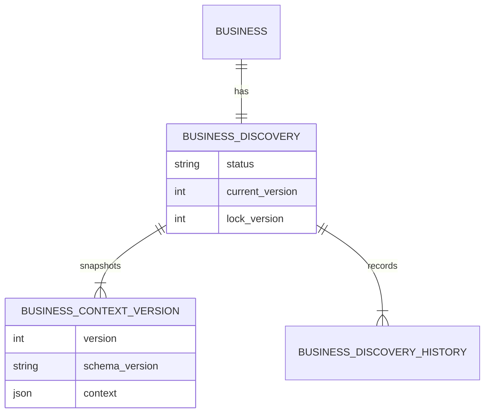

# Business Context Domain

## Aggregate

`BusinessDiscoveryRecord` is the aggregate root. It is uniquely identified by
`orgId` and `businessId`, references the existing business identity, and owns:

- lifecycle status;
- discovery version;
- optimistic lock version;
- schema version;
- immutable context snapshots;
- append-only change history.

`ResolvedBusinessContext` is the read contract exposed to consumers. It adds
active goals, active constraints, and a capability maturity summary derived
from existing tenant-scoped repositories.

## Canonical Data

`CanonicalBusinessContextData` contains:

- organization profile;
- industry and business model;
- products and services;
- customer segments;
- revenue streams;
- departments;
- team structure;
- goals;
- challenges;
- KPIs;
- compliance requirements;
- typed extension metadata.

All nested entities have stable IDs. IDs must be unique within a context.
Metadata supports source, confidence, and additive extensions without changing
the base schema.

## Invariants

1. The execution tenant must match the requested organization.
2. The context organization ID must match the aggregate tenant.
3. Discovery is unique per tenant and business.
4. Content updates are allowed only in `draft` or `in_progress`.
5. Validation requires organization identity, industry, business model, and at
   least one offering.
6. Revenue percentages remain between 0 and 100.
7. Employee count cannot be negative.
8. Published context is required for workflow and agent execution.

## Backward Compatibility

Existing `Business`, `BusinessProfile`, and `BusinessMRI` types are unchanged.
Older diagnostic paths continue to compile. New code must resolve discovery
facts through `BusinessContextService`; direct use of legacy profile tables is
not a supported canonical-context contract.
