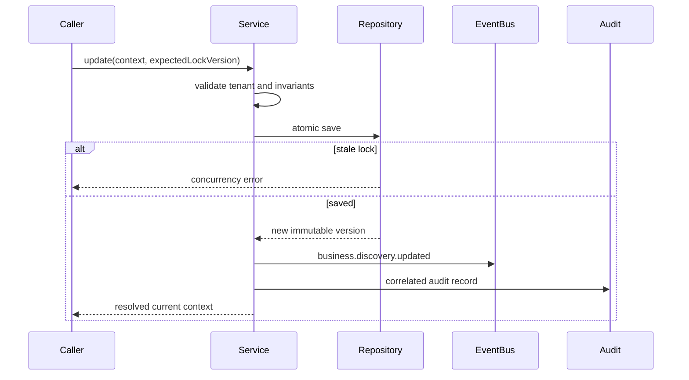

# Business Context Service

## Authority

`BusinessContextService` is the only supported API for canonical discovery
facts. It exposes:

- `create`;
- `update`;
- `transition`;
- `getCurrent`;
- `listVersions`;
- `listHistory`.

`getCurrent` returns status, last update, discovery version, active goals,
active constraints, capability summary, and the full canonical snapshot.

## Mutation Contract

Every mutation requires tenant execution context. Updates and lifecycle
transitions also require `expectedLockVersion`, a reason, actor, request,
correlation, and trace identifiers.

## Execution Integration

`BusinessContextExecutionGuard` resolves the context through this service and
accepts only `published` status. `WorkflowRuntime` and `AgentRuntime` default
to an unconfigured guard that fails closed. Production composition must supply
the canonical guard.

`BusinessContextAgentProvider` gives agents the same resolved context after
the guard succeeds. This prevents agent-specific discovery models.

## Events

Every discovery event carries tenant ID, organization ID, business ID,
discovery ID/version, correlation ID, trace ID, and timestamp in addition to
the standard event context.

## Failure Behavior

- Tenant mismatch: rejected before persistence.
- Missing business: rejected.
- Duplicate discovery: rejected.
- Stale lock: rejected.
- Invalid lifecycle transition: rejected.
- Missing or non-published execution context: execution rejected.
