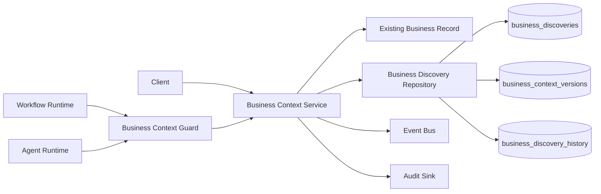
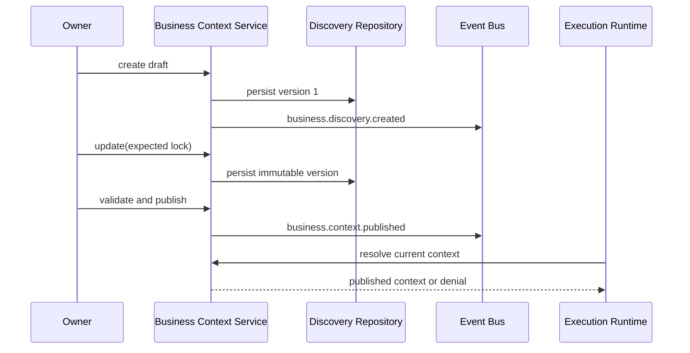

# Business Discovery Foundation

Delivery unit: Epic 2 - Business Discovery / Discovery capability /
Canonical Context Foundation batch

## Decision

**Engineering GO, environmentally blocked for PostgreSQL certification.**

This batch establishes the canonical, versioned, tenant-scoped Business
Context. It does not implement the Business Knowledge Graph, discovery
intelligence, diagnostics, strategy, planning, recommendations, or UI.

## Architecture

The existing `businesses` record remains the business identity. The new
aggregate links to it and owns the discovery facts. Existing Business Profile
and MRI models remain compatibility inputs for older diagnostics; they are not
parallel canonical context services.

## Supported Journey

## Registry Integration

| Registry | Entry |
| --- | --- |
| Feature | `canonical_business_discovery` |
| Runtime | `business_context_runtime` |
| Policy | `execution.business_context_required` |
| Events | `business.discovery.created`, `business.discovery.updated`, `business.discovery.validated`, `business.context.published` |

## Validation Evidence

- Canonical create, update, resolve, lifecycle, archive, audit, and event flow:
  passed.
- Immutable version history and stale-write rejection: passed.
- Cross-tenant retrieval and profile mismatch denial: passed.
- Workflow denial before publication and execution after publication: passed.
- Agent execution through the same published context: passed.
- Registry and dependency graph integrity: passed in focused tests.
- Migration structure, RLS, constraints, and sequence: passed static tests.
- Live PostgreSQL migration and RLS: blocked because no database target exists.

| Gate | Result |
| --- | --- |
| Typecheck | 21/21 tasks passed |
| Lint | 21/21 tasks passed |
| Tests | 79 assertions passed |
| Build | 11/11 tasks passed |
| Architecture | 203 modules, 531 dependencies, zero violations |
| Dead code | `knip` passed |
| Live migration | `ECONNREFUSED` on port 5432 |

## Readiness

The Canonical Context Foundation batch receives **Engineering GO With
Environmental Blocker**. A live PostgreSQL environment is still required to
certify migration `0012` and RLS behavior.

The next eligible delivery unit is Epic 2 / Business Discovery / Business
Knowledge Graph capability / Graph Foundation batch. It must remain separate
from Discovery Intelligence and every OC2.3 batch.
