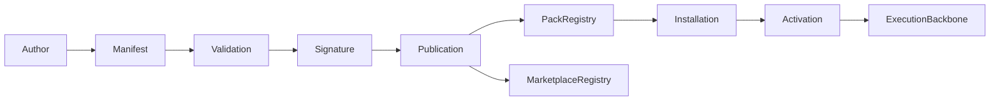

# Capability Pack Platform

## Status

Engineering implementation for BOSS Platform Extensibility, Phase B. This
platform manages implementation artifacts beneath the Business Capability
Model; it does not yet implement Business Capability bundles or lifecycle
governance.

## Architecture

`@boss/capabilities` owns manifest validation, compatibility checks, trusted
signatures, dependency resolution, tenant installations, activation, upgrades,
rollback, removal, and immutable history. Pack modules expose only
`activate`/`deactivate`; capability execution remains an Execution Backbone
responsibility.

## Supported Types

Diagnostic, strategy, planning, workflow, automation, policy, AI prompt,
industry, connector, and dashboard packs share one contract and lifecycle.

## Boundaries

- Pack operations require matching tenant and event context.
- Published releases require a trusted Ed25519 signature.
- Required dependencies and permissions are fail-closed.
- Active upgrade failures reactivate the previous version.
- Static architecture rules prohibit dependencies on application or domain
  runtimes.

## Known Limitations

The default repository and trust store are process-local. Durable persistence,
distributed loading, key rotation, revocation, sandboxed code loading, and the
Universal Capability Runtime are separate batches.
