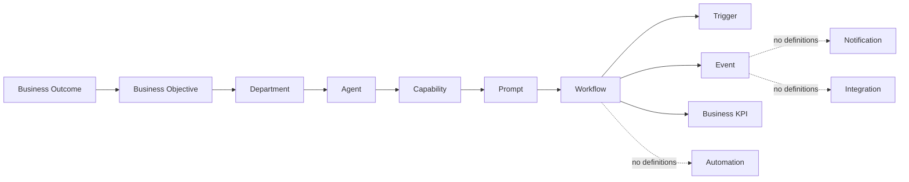

# Dependency Graph

Certification date: 2026-06-27

The graph is a readonly metadata snapshot. Node references use `{ registry,
id }`; edges contain IDs and relationship names only.

## Graph Metrics

| Metric | Result |
| --- | ---: |
| Nodes | 97 |
| Edges | 109 |
| Duplicate node IDs | 0 |
| Broken references | 0 |
| Cycles | 0 |
| Missing owners | 0 |
| Unused prompts | 0 |
| Orphan nodes | 26 |

The 26 orphans are six capabilities without agent assignments, seventeen
canonical events without current workflow edges, and three KPIs not assigned
to current agents/workflows.

Generated indexes cover agent-to-workflow, agent-to-capability,
workflow-to-events, workflow-to-automations, workflow-to-triggers,
automation-to-notifications, event publishers/subscribers,
department-to-agents, and integration-to-workflows.

Impact models provide upstream and downstream traversal for agents,
capabilities, workflows, automations, events, departments, and business
outcomes. They cannot execute graph nodes.
