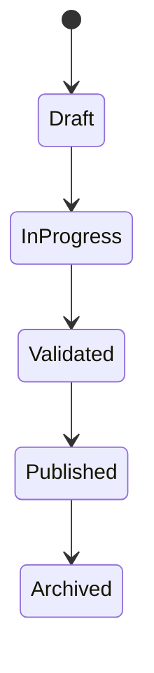

# Discovery Versioning

## Two Versions

Discovery uses separate counters:

| Counter | Changes when | Purpose |
| --- | --- | --- |
| `discoveryVersion` | Context facts change | Immutable business-fact history |
| `lockVersion` | Any aggregate mutation occurs | Optimistic concurrency |

A lifecycle transition does not invent a new business-fact snapshot. It
increments `lockVersion` and appends history. A content update increments both.

## Lifecycle



No shortcuts or reverse transitions are supported in this batch.

## Persistence

- `business_discoveries` stores current lifecycle and counters.
- `business_context_versions` stores immutable JSON snapshots.
- `business_discovery_history` stores every create, update, and transition with
  actor, reason, correlation ID, trace ID, and timestamp.

All three tables carry `org_id`, explicit tenant predicates, indexes, and RLS
policies using `boss_current_org_id()`.

## Optimistic Concurrency

PostgreSQL mutations use:

```sql
WHERE org_id = $1
  AND business_id = $2
  AND lock_version = $3
```

No matching row produces `BusinessDiscoveryConcurrencyError`. Snapshot and
history writes occur in the same transaction as the aggregate update.

## Compatibility

Schema version `1.0.0` identifies the context document shape. Future additive
fields belong in typed extensions first; destructive shape changes require a
new schema version and an explicit upgrade path.
