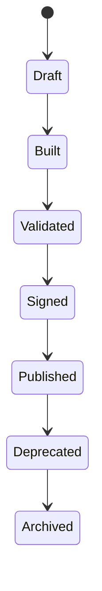

# Pack Lifecycle

Transitions are forward-only and auditable. Failed validation leaves the
release in `Built`; failed signature verification leaves it in `Validated`.
Only `Published` releases can be installed.

Tenant installations progress independently through `Installed` and
`Activated`. Upgrade records the prior version; rollback uses that version
through the same compatibility, dependency, permission, and activation checks.
Removal is denied while another installed pack has a required dependency.

Release history and tenant history are immutable ordered evidence. Business
Capability certification, release, operation, and retirement gates are governed
by the separately adopted Business Capability Lifecycle.
