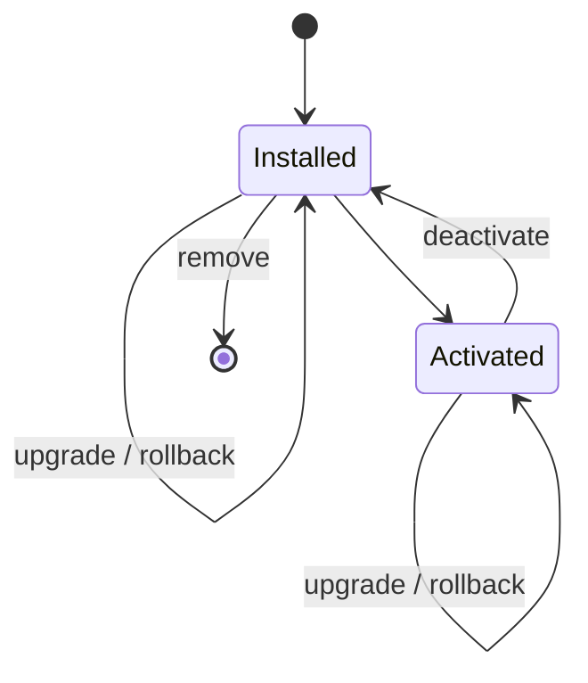

# Pack Runtime

## Components

- `PackLoader`: resolves a registered module by immutable `packId@version`.
- `PackResolver`: validates installed dependency ranges and prevents unsafe
  removal.
- `CompatibilityValidator`: validates platform, runtime API, and registry use.
- `ActivationService`: invokes module activation and deactivation.
- `CapabilityPackPlatform`: coordinates release and tenant lifecycle.

## Tenant Lifecycle

An upgrade validates the target before touching the current installation. If an
active target fails to activate, the prior version is reactivated and persisted
installation state remains unchanged.

Modules are registered descriptors, not arbitrary dynamic imports. The future
Universal Capability Runtime will execute pack workloads; CPP only governs pack
loading and activation.
