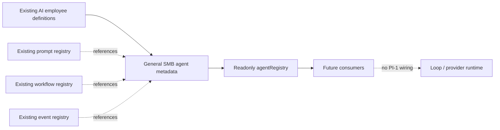

# PI-1 Agent Registry

> Historical PI-1 discovery snapshot. Runtime status is superseded by
> `RUNTIME_IMPLEMENTATION_CERTIFICATION.md`.

Certification date: 2026-06-26

## Scope

Batch 1 establishes a readonly, declarative `agentRegistry`. It does not
instantiate agents, change workflows, schedule work, call providers, or alter
runtime execution paths.

## Discovery Inventory

| Kind | Count | Source | Finding |
| --- | ---: | --- | --- |
| AI employees | 7 | `industry-packs/general-smb/src/data/aiEmployees.ts` | Declarative definitions; all lifecycle values are `draft`. |
| Agent registry | 1 | `packages/registries/src/registries/agent.ts` | Readonly public access with capability-pack registration. |
| Prompts | 7 | `industry-packs/general-smb/src/data/prompts.ts` | One existing system prompt per AI employee. |
| Workflows | 6 | `industry-packs/general-smb/src/data/workflows.ts` | Definitions only; no execution implementation. |
| Trigger identifiers | 3 | `packages/registries/src/registries/workflow.ts` | `manual`, `event`, and `schedule`. |
| Agent lifecycle events | 3 | `packages/registries/src/seed/events.ts` | `agent.created`, `agent.started`, and `agent.completed`. |
| Automations | 0 | Repository search | No automation registry or executable automation definition exists. |
| Departments | 0 | Repository search | `departmentId` exists in ontology, but no department catalog exists. |
| Agent orchestrators | 0 | Repository search | API services orchestrate business intelligence, not agent execution. |
| Agent runtimes | 0 | `packages/loop`, `packages/events` | Contracts exist; no agent execution runtime is implemented. |
| Queues or cron jobs | 0 | Repository search | No queue, worker, scheduler, or cron implementation exists. |

The command-center agent and automation cards in
`apps/web/src/commandCenter.ts` are generated presentation data. They are not
agent definitions, runtime registrations, or health probes.

## Existing Agents

| Key | Name | Prompt | Existing workflows referenced | Trigger identifiers |
| --- | --- | --- | --- | --- |
| `ceo_advisor` | CEO Advisor | `ceo_advisor.system` | `administrative_automation` | `manual` |
| `ai_front_desk` | AI Front Desk | `ai_front_desk.system` | `appointment_reminder` | `schedule` |
| `ai_follow_up_assistant` | AI Follow-Up Assistant | `ai_follow_up_assistant.system` | `lead_follow_up_recovery`, `customer_re_engagement` | `event`, `schedule` |
| `ai_operations_coordinator` | AI Operations Coordinator | `ai_operations_coordinator.system` | `appointment_reminder`, `administrative_automation` | `schedule`, `manual` |
| `ai_review_manager` | AI Review Manager | `ai_review_manager.system` | `review_request` | `event` |
| `ai_collections_assistant` | AI Collections Assistant | `ai_collections_assistant.system` | `invoice_follow_up` | `schedule` |
| `ai_reporting_analyst` | AI Reporting Analyst | `ai_reporting_analyst.system` | None currently defined | None currently defined |

Workflow associations are declarative references based on the existing agent
mission and workflow definitions. They do not connect either side to a runtime.
No automation identifiers were added because none exist.

## Type System

`packages/registries/src/registries/agent.ts` defines:

- `Agent`, `AgentRegistry`, `Department`, `Capability`, and `Skill`
- `Workflow`, `WorkflowReference`, `Trigger`, and `Automation`
- `NotificationChannel`, `BusinessDomain`, and `ExecutionMode`
- `Lifecycle`, `Dependencies`, `HealthStatus`, and `AgentVersion`
- `PromptReference`, `EventReference`, and `RegistryMetadata`

Agent fields and nested collections are readonly. `agentRegistry.list()` returns
a frozen readonly snapshot, registered entries are frozen, duplicate keys are
rejected, and the public registry surface exposes only `list()` and `get()`.

## Architecture



The registry is the authoritative source for the new `Agent` metadata model.
`aiEmployeeRegistry` remains available as a backward-compatible legacy
definition surface during PI-1. Both are seeded from the same existing
`aiEmployees` constant, preventing a second employee catalog.

## Registry Invariants

1. Every existing AI employee has exactly one agent entry with the same key,
   label, mission, responsibilities, lifecycle, capabilities, tools, and
   permissions.
2. Prompt, workflow, event, and trigger references use identifiers already
   present in the repository.
3. Missing concepts remain explicit: automation, department, notification,
   business-domain, and skill references are empty.
4. Health is `not_registered` because no agent runtime exists.
5. Registry code is declarative and imports no API, UI, Loop, event runtime,
   provider, queue, scheduler, or database implementation.

## Certification Procedure

Run from the repository root:

```powershell
pnpm typecheck
pnpm --filter @boss/industry-pack-general-smb test
git diff --name-only
```

The focused test certifies one-to-one employee coverage, unique agent keys,
existing reference resolution, empty automation references, and non-runtime
health. The file diff is the executable boundary check: Batch 1 must not modify
runtime imports or execution-path files.

## Validation Results

| Check | Result | Evidence |
| --- | --- | --- |
| Workspace typecheck | Pass | `pnpm typecheck`: 20 tasks successful across 12 packages. |
| Registry and SMB lint | Pass | Both package lint tasks completed with zero warnings. |
| Focused registry tests | Pass | 1 file passed; 8 tests passed. |
| Duplicate agent keys | Pass | Test compares registry size with unique key count and all 7 legacy employees. |
| Existing references | Pass | Tests resolve every prompt and workflow reference and constrain events/triggers to discovered identifiers. |
| Runtime boundary | Pass | Batch files are limited to registry types/exports, SMB declarative seed data/tests, and this document. No API, UI, Loop, event runtime, MCP, database, workflow, prompt, queue, or provider file was edited by Batch 1. |

The working tree contained unrelated API, web, package, and documentation
changes before Batch 1. Those pre-existing changes were preserved and are not
part of this certification.

## Deferred

The SMB metadata layer, normalized capability registry, workflow/event/trigger/
automation registries, dependency graph, full backward-compatibility report,
registry validation report, and PI-1 production certification belong to
Batches 2 through 8 and were not executed.
