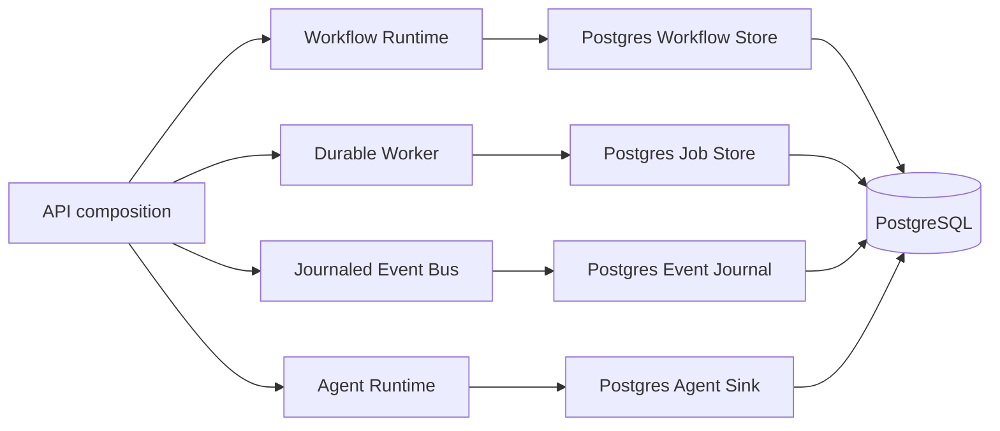

# RCIP Program A Certification

Date: 2026-06-27

## Decision

**NO-GO for RC1. ESGAP entry is blocked.**

This increment establishes the first production durability boundary. It does
not certify a deployed release candidate. Programs B and C, and all ESGAP
programs, remain gated on Program A evidence.

## Implemented

- Migration `0018_runtime_durability.sql` defines tenant-scoped workflow,
  queue, schedule, event, agent-execution, and checkpoint state.
- Runtime tables use UUID identities, `org_id`, timestamps, indexes, and RLS
  policies based on `boss_current_org_id()`.
- `PostgresWorkflowExecutionStore` persists workflow transitions and requires
  `orgId` for reads.
- `PostgresRuntimeJobStore` supports idempotent enqueue, bounded attempts,
  dead-letter transitions, retry delays, worker leases, and
  `FOR UPDATE SKIP LOCKED` claims.
- `PostgresRuntimeWorker` records startup, readiness, draining, and stopped
  heartbeats and only completes work while owning its lease.
- `JournaledEventBus` records tenant, correlation, and trace context before
  dispatch.
- `PostgresAgentExecutionSink` records terminal agent execution results.
- Loop resilience primitives provide bounded exponential retry with jitter,
  operation timeouts, and closed/open/half-open circuit breaking.
- Existing in-memory implementations remain available for tests and local
  development.

## Architecture

The runtime package does not import PostgreSQL. Production adapters live in
the API composition boundary, preserving the existing package architecture.

## Program A Evidence

| Gate | Status | Evidence / missing evidence |
| --- | --- | --- |
| A1 Durable Runtime | Partial | Schema and workflow/event/agent adapters plus atomic schedule-to-job handoff exist. Approval records, live migration, and restart recovery tests are missing. |
| A2 Distributed Execution | Partial | Idempotency, leases, heartbeats, dead-letter transitions, and skip-locked claims are tested. Multi-process and load evidence is missing. |
| A3 Browser Security | Not certified | No production browser auth callback, refresh-cookie, CSRF, session-expiry, or protected-route E2E evidence. |
| A4 Supabase/PostgreSQL | Partial | RLS policies are defined statically. No deployed Supabase project, migration run, tenant-isolation integration test, backup, or restore drill was available. |
| A5 Infrastructure | Not certified | No Docker deployment, production hosting, CI/CD promotion, secrets manager, TLS, DNS, or rollback evidence. |
| A6 Observability | Not certified | Existing structured in-memory telemetry is not connected to production exporters, dashboards, or alerting. |
| A7 Resilience | Partial | Retry, timeout, circuit-breaker, idempotency, leases, and dead-letter mechanics have unit coverage. Provider integration and failure-injection evidence are missing. |
| A8 Program Gate | Failed | A1-A7 are not all complete; distributed integration, failure recovery, security, load, and E2E suites have not passed. |

## Validation

Affected validation:

- `@boss/loop` typecheck: pass
- `@boss/loop` lint: pass
- `@boss/loop` tests: 7/7 pass
- `@boss/db` typecheck: pass
- `@boss/db` tests: 4/4 pass
- `@boss/api` typecheck: pass
- `@boss/api` lint: pass
- `@boss/api` tests: 15/15 pass

Full-workspace validation:

- Typecheck: 21/21 tasks pass
- Lint: 21/21 tasks pass
- Tests: 21/21 tasks pass; 60 executable assertions pass
- Production build: 11/11 tasks pass; Next.js production bundle generated
- Migration validation: pass
- Dependency boundaries: pass; 162 modules and 434 dependencies analyzed,
  zero violations
- Dead-code analysis: Knip pass

## Security Notes

- Runtime reads and mutations include tenant predicates. RLS is defense in
  depth, not a replacement for server-side authorization.
- Production requests must set `app.current_org_id` transaction-locally or
  supply a verified JWT with an `org_id` claim.
- Service-role credentials must remain server-only. Because privileged
  database roles can bypass RLS, explicit `org_id` predicates are mandatory.
- A stale worker cannot complete a job after another worker takes ownership
  because completion and failure mutations require the current lease owner.

## Known Risks

- Migration SQL has static tests but has not been executed against the target
  PostgreSQL/Supabase version.
- The production API composition does not yet select these adapters by
  environment.
- Atomic schedule claiming and enqueue has local SQL-contract coverage but
  still needs deployed concurrency, crash, replay and recovery validation.
- Event delivery acknowledgements and subscriber retry state are not durable.
- Agent input, intermediate tool state, approvals, and memory remain
  incomplete durability surfaces.
- The current web application is not a certified authenticated SaaS shell.

## Required Next Gate

1. Run migration `0008` in an isolated PostgreSQL environment and add
   database-backed integration tests for RLS, crash recovery, duplicate
   delivery, and concurrent claims.
2. Add durable event subscriber delivery records and validate atomic schedule
   handoff under concurrent workers and injected crashes.
3. Wire durable adapters into production composition with graceful worker
   startup and shutdown.
4. Complete browser authentication and protected-route E2E tests.
5. Establish deploy, rollback, backup/restore, observability, security, and
   load evidence before reconsidering RCIP Program B.

## ESGAP Entry Gate

ESGAP assumes RC1 and RC2 are complete. That assumption is currently false.
No Program D, E, or F capability is certified or represented as complete.
