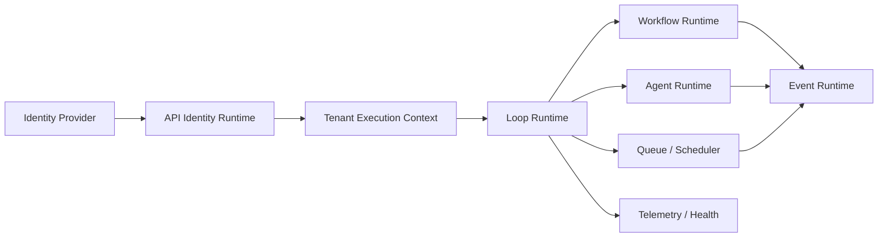

# Runtime Implementation Certification

Certification date: 2026-06-27

## Decision

**INTERNAL-ALPHA GO**

The BOSS runtime is executable and covered by deterministic certification
tests. It is not approved for production deployment until durable adapters,
external identity configuration, distributed workers, and production
observability are certified.

## Validation Results

| Gate | Result |
| --- | --- |
| Typecheck | 21/21 Turbo tasks passed |
| Lint | 21/21 Turbo tasks passed |
| Tests | 21/21 Turbo tasks; 51 executable assertions passed |
| Build | 11/11 tasks passed, including Next.js production build |
| Architecture | 158 modules, 424 dependencies, 0 violations |
| Dead-code analysis | Knip passed |
| Business lifecycle | Signup through logout completed successfully |

## Implemented Runtime

| Phase | Implementation | Evidence |
| --- | --- | --- |
| Authentication | Provider-backed sign-up/sign-in, verification state, refresh, logout revocation, password-reset request, expiration, remember-me metadata | Identity runtime tests |
| Tenant security | Organization memberships, organization switching, centralized request context, RBAC, tenant rejection, audit records | Identity and lifecycle tests |
| Execution lifecycle | Startup, shutdown, runtime registry activation, component health | Loop runtime tests |
| Workflow | Registered definitions, persisted state interface, steps, approvals, retries, compensation, outputs, failure events | Loop runtime tests |
| Automation | In-memory queue, bounded retry, dead-letter, replay, due-job scheduler, worker handlers | Loop runtime tests |
| Events | Typed routing, publishers/subscribers, organization/request/correlation/trace context, delivery records | Event tests |
| AI agents | Registry activation, context retrieval, prompt resolution, injected model, permitted tools, scoped memory, history, metrics | Loop runtime tests |
| Observability | Structured runtime logs, metrics, event deliveries, execution history, health and queue diagnostics | Loop/API tests |
| Business lifecycle | Signup through organization, diagnostic, workflow, agent, automation, report, insight, and logout | API lifecycle certification test |

## Architecture

- `apps/api` owns identity, tenant resolution, authorization middleware, audit,
  and the Supabase adapter.
- `packages/events` owns context-enforced event routing and delivery records.
- `packages/loop` owns agent, workflow, queue, scheduler, state, telemetry, and
  runtime lifecycle behavior.
- Registries remain declarative. Runtime activation references registry IDs and
  does not mutate definitions.

## Persistence and Provider Boundaries

Production-shaped interfaces exist for:

- Identity provider
- Organization membership store
- Workflow execution store
- Agent model
- Context retrieval
- Agent memory
- Agent tools
- Event delivery sink
- Runtime telemetry

In-memory implementations are used for local execution and certification.
Supabase is implemented as the external identity adapter. Durable workflow,
membership, queue, memory, telemetry, and scheduler adapters remain open.

## Security Properties

- Password verification and token issuance are delegated to Supabase.
- Access-token verification occurs through the identity provider.
- Server-side logout requires `SUPABASE_SERVICE_ROLE_KEY`.
- Every authorized operation requires an active organization membership.
- Existing RBAC permissions are enforced after tenant resolution.
- Runtime events require organization, actor, request, correlation, and trace
  identifiers.
- Security-sensitive identity operations emit audit events without credentials
  or tokens.

## Recovery Properties

- Workflow steps have bounded attempts.
- Completed workflow steps can compensate in reverse order.
- Queue jobs retry up to a declared maximum.
- Terminal failures enter the dead-letter collection.
- Dead-letter jobs can be replayed with attempts reset.
- Scheduled jobs enqueue only when due.
- Runtime health exposes queue depth and dead-letter counts.

## Known Limitations

- Workflow, membership, queue, schedule, memory, event-delivery, and telemetry
  adapters are in-memory.
- Workflow approval can pause but does not yet expose a persisted resume API.
- Queue workers are single-process and sequential.
- Scheduling requires `runtime.tick()` and has no distributed lease.
- Supabase integration requires live project configuration and deployment
  verification.
- There is no browser authentication UI or protected Next.js route middleware.
- Agent execution requires an injected model; no model provider is selected by
  default.
- Metrics and traces have no OpenTelemetry exporter or production backend.

## Production Exit Gates

1. Add Postgres-backed membership, workflow, schedule, and execution stores.
2. Use a durable queue with worker leases, idempotency keys, and concurrency
   controls.
3. Add persisted approval resume and cancellation.
4. Add Next.js authentication callbacks and protected-route middleware.
5. Verify Supabase token rotation, logout revocation, RLS, and secret handling
   in a deployed environment.
6. Add OpenTelemetry exporters, dashboards, alerts, and SLOs.
7. Run load, failover, replay, duplicate-delivery, and cross-tenant security
   tests.
