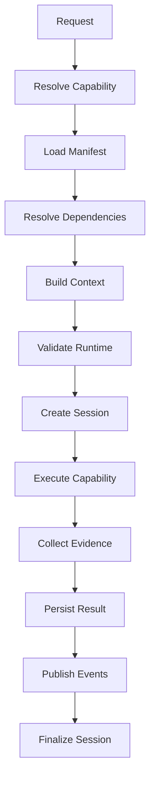

# UCR Execution Pipeline

## Architecture

`CapabilityExecutionPipeline` creates an execution ID and delegates the exact
twelve-stage sequence to `PipelineCoordinator`. The coordinator rejects any
missing, reordered, or additional stage.

Capability metadata, pack manifests, dependencies, runtime metadata, and
feature status resolve only through platform registries. A supplied
`CapabilityExecutor` receives a `running` immutable execution and returns a
terminal generic result. No business implementation is imported by UCR.

## Events

- `capability.execution.pipeline.started`
- `capability.execution.stage.started`
- `capability.execution.stage.completed`
- `capability.execution.pipeline.completed`
- `capability.execution.pipeline.failed`

Payloads include execution, stage, capability/version, tenant, correlation,
trace, runtime version, and timestamp. Batch 1 execution events remain active.

## Failure Model

The coordinator identifies the exact failed stage, runs cleanup, stops later
stages, emits pipeline failure, and returns a typed failed result. If a session
exists and is nonterminal, UCR transitions it to `failed`. No retry, replay, or
rollback occurs.
