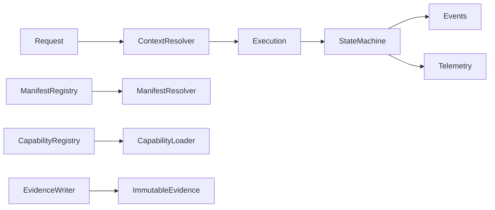

# UCR Runtime Core

## Scope

Batch 1 establishes capability-agnostic contracts and lifecycle control. It
does not execute Capability Packs or business logic.

Canonical contracts are `CapabilityExecution`, `CapabilityExecutionId`,
`CapabilityExecutionContext`, `CapabilityExecutionSession`,
`CapabilityExecutionRequest`, `CapabilityExecutionResult`, and
`CapabilityExecutionMetadata`.

Runtime interfaces are `CapabilityExecutor`, `CapabilityLoader`,
`ContextResolver`, `ManifestResolver`, `DependencyResolver`, and
`EvidenceWriter`. Default adapters fail closed. The executor deliberately
throws `RuntimeFailureError` because execution begins in Batch 2.

Registry status:

- `universal_capability_runtime`: internal alpha.
- `capability_execution_state_machine`: internal alpha.
- `capability_execution_pipeline`: internal alpha after Batch 2 certification.
