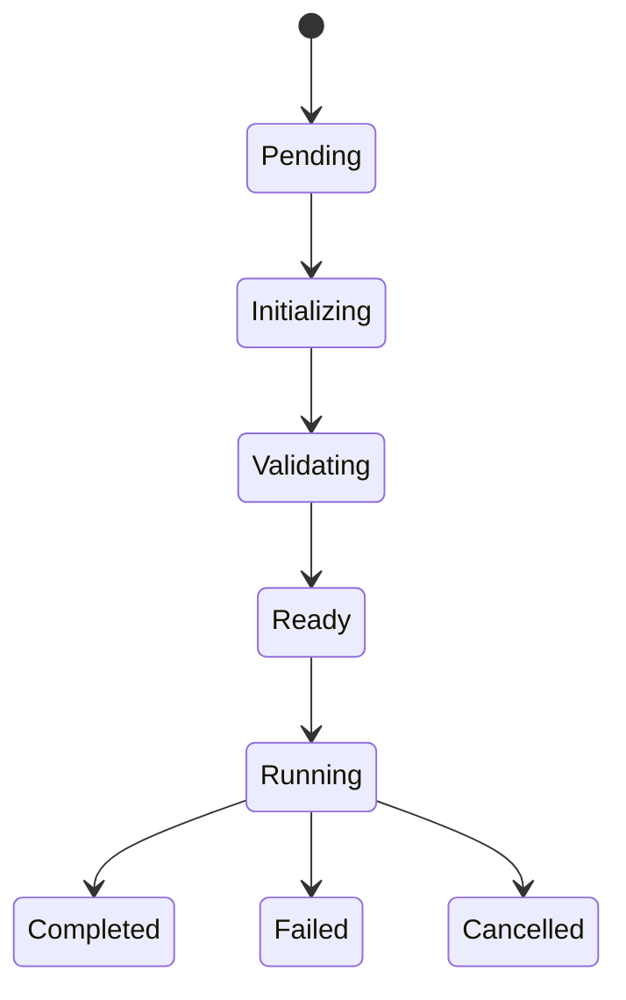

# UCR Session Model

The pipeline allocates an execution ID before metadata resolution so every
pipeline event has stable identity. The UCR session itself is created only
after capability, manifest, dependencies, context, and runtime validation.

Validation and dispatch failures may enter `failed` from their valid
pre-running states. Terminal sessions set `closedAt`, duration, failure reason,
and immutable transition history.

Execution results are written before final session transition as required by
the canonical sequence. The result writer and evidence writer are injectable;
Batch 2 defaults are deterministic process-local stores.
