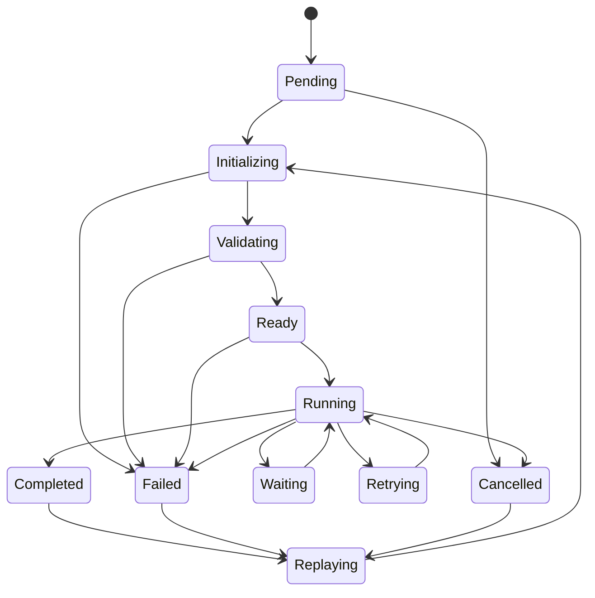

# UCR State Machine

Initializing, validating, waiting, retrying, and replaying also permit
controlled failure or cancellation where applicable. Every unsupported edge,
including self-transition, throws `InvalidExecutionStateError`.

Transitions return new deeply frozen execution snapshots. Metadata records
timestamps, duration, retry count, failure reason, and immutable transition
history. This models replay state only; replay execution is out of scope.
