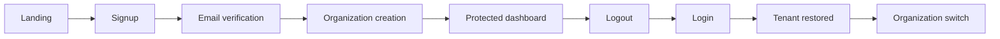

# OC1 Wave A Production Certification Closure

Date: 2026-06-28

## Decision

**GO With Environmental Blockers**

Wave A is implementation-complete and passes every repository-owned gate.
Production deployment is not certified because this environment has no
Supabase project, PostgreSQL target, email provider, or production secrets.
No application-code blocker remains from the checks available here. Wave B was
not started.

## Environment Summary

| Dependency | Evidence | Status |
| --- | --- | --- |
| `SUPABASE_URL` | Environment probe | Unavailable |
| `SUPABASE_ANON_KEY` | Environment probe | Unavailable |
| `SUPABASE_SERVICE_ROLE_KEY` | Environment probe | Unavailable |
| `DATABASE_URL` | Environment probe | Unavailable |
| `BOSS_AUTH_CALLBACK_URL` | Environment probe | Unavailable |
| PostgreSQL | No listener on port 5432 | Unavailable |
| Supabase/Docker/psql CLI | Command discovery | Unavailable |
| Local Next.js | `127.0.0.1:3000` | Available |

The unavailable items are deployment inputs, not capabilities that can be
implemented safely in the repository without a target environment.

## Implemented Identity Surface

- Browser signup, verification callback, sign-in, refresh, expiration, logout,
  Remember Me, and protected navigation.
- Password recovery request, recovery callback, password update, provider
  revocation, and local cookie clearing.
- Durable organization, owner membership, active-tenant preference, and
  membership-checked organization switching.
- HTTP-only, `SameSite=Lax` cookies; production policy enables `Secure`.
- Server-side provider verification before protected rendering.
- Durable identity and organization audit adapter with awaited writes.
- Landing-page signup and sign-in integration.

## Database and RLS Evidence

Migration `0021_identity_organizations.sql` defines:

- `organizations`;
- `organization_memberships`;
- `user_tenant_preferences`;
- `identity_audit_events`;
- membership and audit indexes;
- role, status, uniqueness, foreign-key, and outcome constraints;
- RLS on all four tables;
- member-scoped organization reads;
- self-scoped membership reads;
- active-tenant writes restricted to active memberships;
- member/actor-scoped audit reads.

Static migration tests pass. Repository tests prove owner creation, active
tenant restoration, switching, and denial for a non-member organization.

The migration CLI entrypoint was repaired for Windows. Before the repair,
`validate-migrations` could exit successfully without executing. It now runs
and correctly reports `ECONNREFUSED` because no PostgreSQL target is present.
Migration application and live RLS queries therefore remain environmental
blockers and are not claimed as passed.

## Browser Evidence

Local HTTP probes returned:

| Check | Result |
| --- | --- |
| `/landing.html` | `200` |
| `/auth/sign-up` | `200` |
| `/auth/sign-in` | `200` |
| `/auth/forgot-password` | `200` |
| `/auth/reset-password` | `200` |
| Landing signup links | 5 |
| Landing sign-in links | 1 |
| Anonymous `/dashboard` | `307` to sign-in |
| Missing session tokens | Structured `400` JSON |
| Missing provider during reset request | Controlled `303` error state |

A real signup/email/login journey could not execute without Supabase, email,
and PostgreSQL. Browser restart and multi-user evidence remain external.

## Session Evidence

Executable cookie tests prove:

- access, refresh, and persistence cookies are HTTP-only;
- all cookies use `SameSite=Lax`;
- non-remembered sessions have no `Max-Age`;
- remembered sessions receive persistence;
- logout expires all three cookies;
- production policy sets `Secure`.

Provider refresh, expiration rejection, logout, verification, password reset,
and authorization behavior are covered by API tests. Live token rotation and
revocation remain provider-dependent.

## Audit Evidence

The browser runtime now uses `PostgresAuditSink`, not an in-memory sink.
Migration `0011` stores tenant, organization, actor, action, outcome, trace,
request, correlation, metadata, and timestamp fields.

Covered actions include:

- signup and failed signup;
- sign-in and failed sign-in;
- verification and failed verification;
- refresh and failed refresh;
- logout and failed logout;
- password-reset request and completion;
- organization creation;
- organization switching and denied switching;
- successful and denied authorization checks.

Unit tests prove audit emission and correlation metadata. Durable writes cannot
be demonstrated until the migration is applied to PostgreSQL.

## Repository Validation

| Gate | Result | Evidence |
| --- | --- | --- |
| Typecheck | Pass | 21/21 tasks |
| Lint | Pass | 21/21 tasks, zero warnings |
| Tests | Pass | 75 assertions |
| Build | Pass | 11/11 tasks; Next.js production build clean |
| Architecture boundaries | Pass | 198 modules, 508 dependencies, zero violations |
| Dead-code analysis | Pass | `knip` clean |
| Migration structure | Pass | 5 DB migration tests |
| Live migration apply | Blocked | PostgreSQL `ECONNREFUSED` |

## Remaining Environmental Certification

Before changing this decision to **Production GO**:

1. Provision Supabase, PostgreSQL, and email delivery.
2. set all documented server environment variables and redirect allowlists;
3. apply migrations through `0011`;
4. execute live RLS tests with two users and two organizations;
5. run signup, verification, reset, login, refresh, logout, restoration, and
   switching in a real browser;
6. inspect durable audit rows and correlation fields;
7. verify production cookie headers over HTTPS;
8. retain screenshots, traces, email evidence, and denied-query output.

## Known Limitations

- No live provider, database, email, or HTTPS evidence exists in this run.
- No claim is made that the unapplied migration works on a specific hosted
  Supabase configuration.
- Dashboard operational values remain demonstration data pending the separate
  Business Discovery wave.

## Final Recommendation

Accept Wave A as **GO With Environmental Blockers**. The implementation may
advance to Wave B under the approved rule because all observed blockers are
external configuration or live-environment evidence. Keep the production
deployment gate closed until the eight environmental checks above pass.
