# PI-2 Architecture Diagrams

## Context

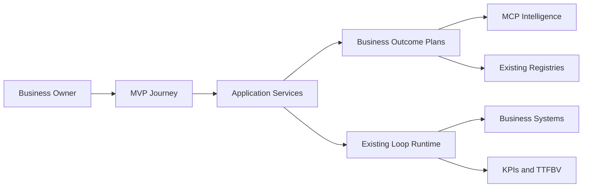

## Capability Dependency Graph

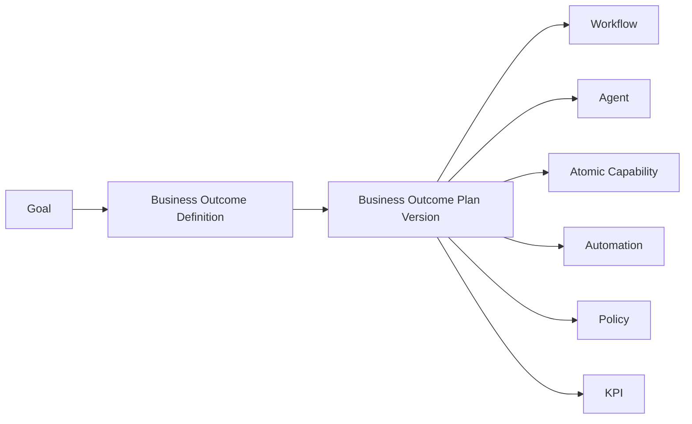

## Runtime Sequence

```mermaid
sequenceDiagram
  actor Owner
  participant API
  participant Resolver
  participant Registries
  participant DB
  participant Queue
  participant Loop
  Owner->>API: Approve plan version
  API->>DB: Persist approval
  API->>Resolver: Resolve approved version
  Resolver->>Registries: Validate IDs and versions
  Resolver-->>API: Execution command
  API->>Queue: Enqueue idempotently
  Queue->>Loop: Claim command
  Loop->>DB: Persist execution state
  Loop-->>API: Correlated result/event
```

## Registry Diagram

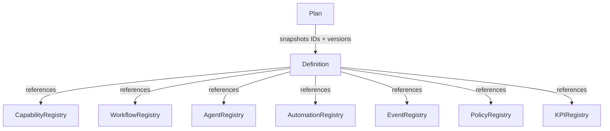

## Event Flow

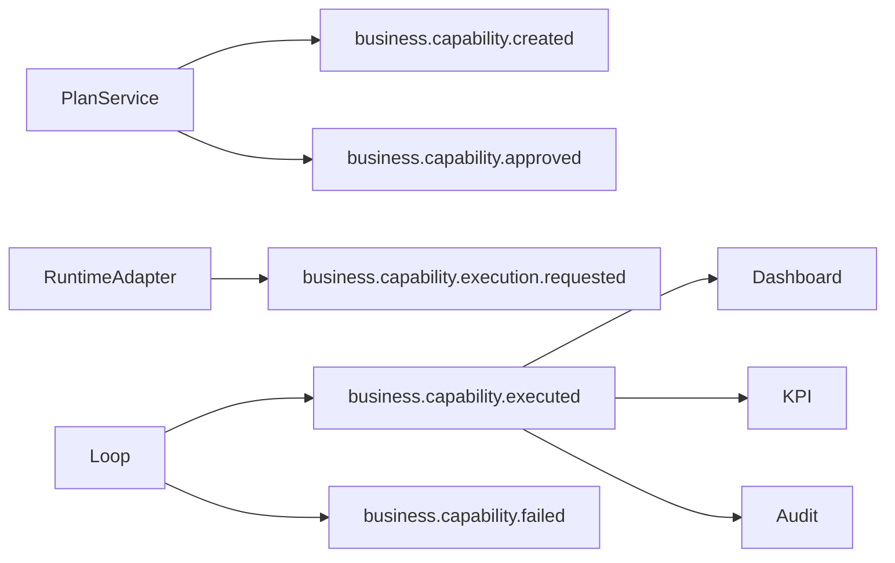

## Lifecycle

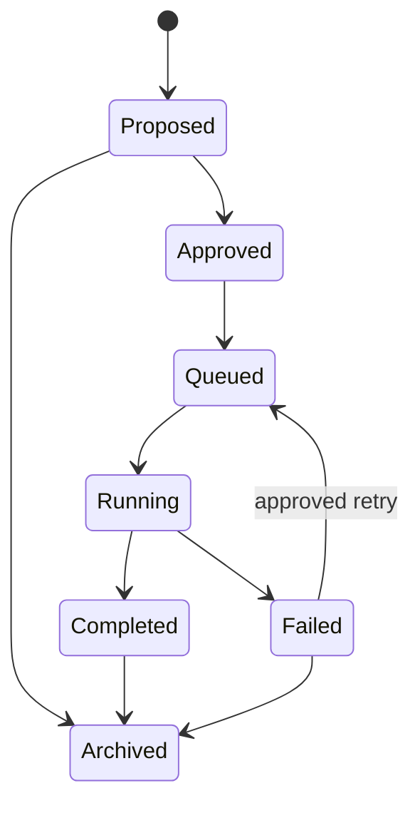

## Marketplace

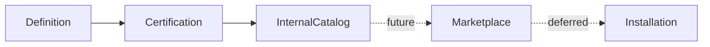

## Builder

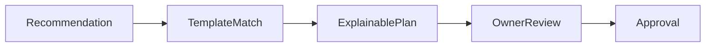

The visual or AI builder is deferred; this is template resolution only.

## Learning Loop

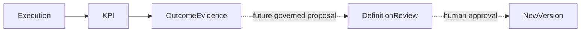

Learning is deferred.

## Simulation

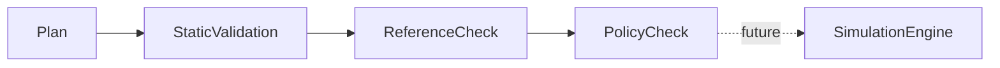

Only static validation is in the MVP roadmap.

## Certification

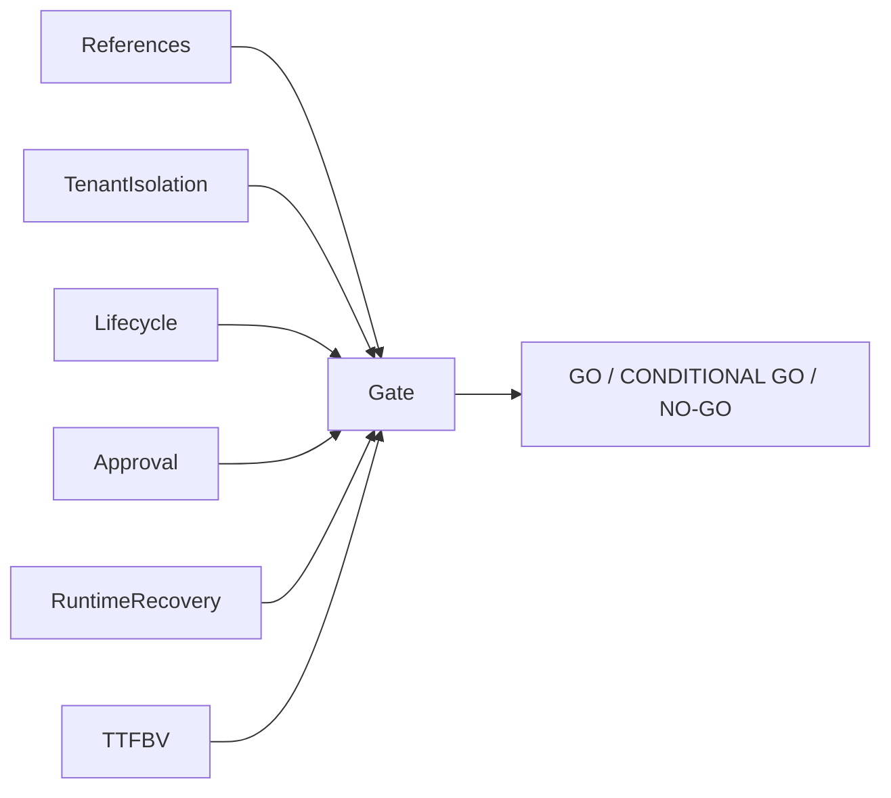

## Analytics

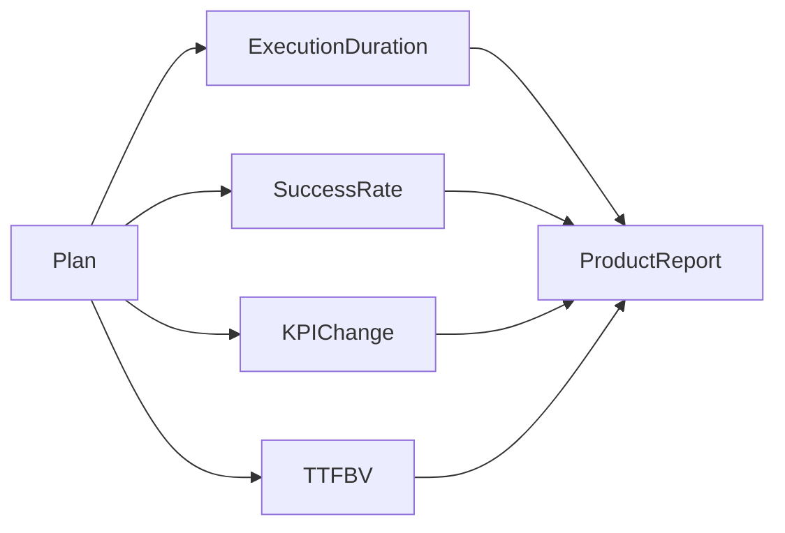

## Deployment

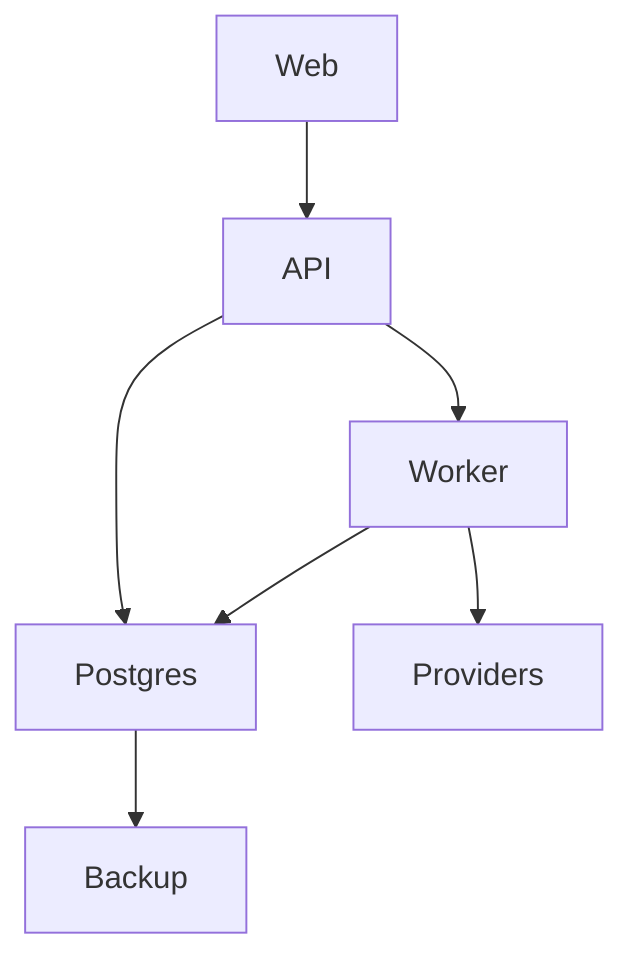

This is a target single-region topology, not deployed evidence.
